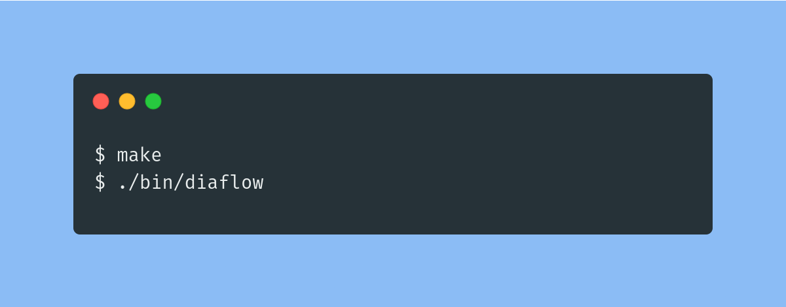
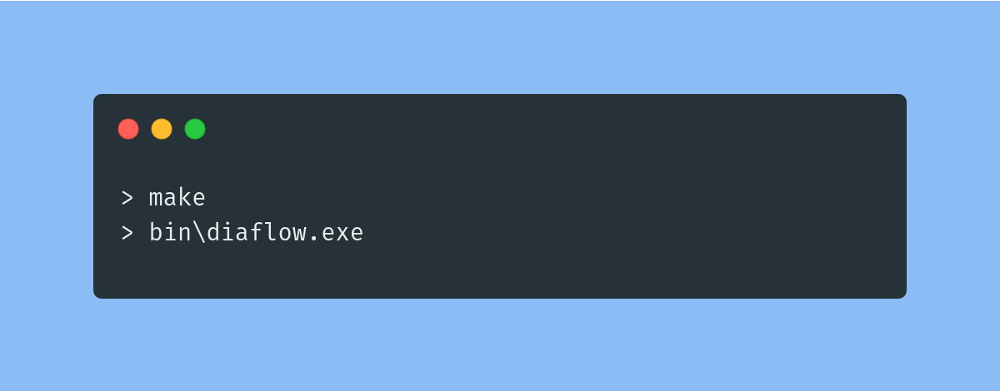

# Diaflow

<h6 style="text-align: center;"> Programming with flowcharts </h6>
A cross platform application that lets you create and test flowcharts.

## Dependencies

[SDL2](https://www.libsdl.org/)
[tinyxml2](https://github.com/leethomason/tinyxml2)

## Installation

To install diaflow on your machine you have to run the following commands:

### On linux and macOS

### On windows

> :memo: **Note:** If the compilation process doesn't work, try checking if you have installed all of the dependencies

## License

Diaflow is licensed under [zlib-libpng](https://opensource.org/licenses/Zlib)

